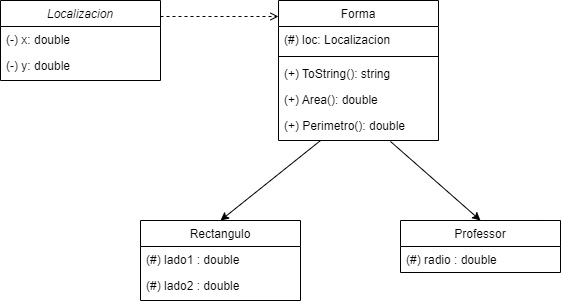

# Presentación
<a href="https://youtu.be/NXci7lByQt0" target="_blank">

</a>  

## Algunos ejercicios que se han presentado en mis Test Técnicos C#.

<div align="justify">
    He actualizado un poco el código, ahora en el program he puesto un menú de opciones que permitiran llamar a los métodos al ingresar la opción válida.
<br>También agregue más opciones.
</div>

📌 1. Números de Fibonacci. 
        Proporciona la serie Fibonacci hasta el número dado.

📌 2. Sumar los dígitos de un número entero.

📌 3. Ordenar las palabras de una frase.

📌 4. Obtener los números primos en un rango dado.

📌 5. Implementación de Clase Persona y Herencia de otras: Estudiante y Profesor.

<div align="justify">
Programa que solicita al usuario nombres de personas y los almacena en una lista de objetos de tipo Persona. Habrá dos tipos de persona: Estudiante y Profesor.

Crear la clase Persona con una propiedad Nombre de tipo string, un constructor que reciba el nombre como parámetro, y sobreescibir el método ToString()
imprimiendo una frase de saludo con el nombre incluido.

Crear dos clases más que hereden de la clase Persona, se llamarán Estudiante y Profesor. La clase Estudiante tiene el método Estudiar que escribe la frase: "Estoy estudiando".
La clase Profesor tendrá el método Explicar que debe escribir la frase: "Estoy explicando".

El programa debe leer la lista personas (Profesores y estudiantes) ya sea en lote o uno por uno, incluirlas como profesor o estudiante, y finalmente llamar a los métodos 
Explicar y Estudiar según el caso.
</div>

📌 6. Movimiento de mouse. 
        Método que establece un área para mover aleatoriamente el puntero del mouse y hacer clic con el botón derecho. Esto lo hará cada minuto hasta la hora configurada.

📌 7. Obtiene la subcadena de la cadena establecida.

📌 8. Implementación de Clase Abstracta Animal y sobre escritura de métodos.

<div align="justify">
    Programa que implemente una clase abstracta Animal con una propiedad Nombre de tipo texto y tres métodos:

        🔖 Asignar Nombre: Recibe un nombre de tipo string.

        🔖 Obtener Nombre: Devuelve el nombre.
        
        🔖 Comer: Método abstracto sin parámetros.
        
    📑 Crear mínimo dos clases que implementen la clase Animal y  que sobreescriban el método Comer, este último método deberá imprimir una frase diferente para cada animal. 

    📑 El programa debe permitir al usuario asignar un nombre al animal escogido, crear un nuevo objeto de ese tipo, y usar los métodos para obtener el nombre e indicar que está comiendo llamando al método respectivo.
</div>

📌 😣. Implementación de diagrama en código. Aún estoy esperando a la inspiración.

```
---
title: Clase Forma
---

classDiagram
Forma --|> Circulo
Forma --|> Rectangulo
Forma --|> Localizacion
Forma : (#) loc: Localizacion
Forma : (+) ToString(): string
Forma : (+) Area() : double
Forma : (+) Perimetro() : double
class Localizacion{
    (-) x : double
    (-) y : double
}
class Rectangulo{
    (#) lado1 : double
    (#) lado2 : double
}
class Circulo{
    (#) radio : double
}

```
<div>
    
</div>

<br/>

🚀 Creo que iré actualizando con los que se vayan presentando.


<br/>

###  Tecnologías usadas en el código. 

🛸 Lenguaje C#

🛰 .Net 6

<br/>

### Algo sobre mí

- 🌱 Actualmente estoy aprendiendo sobre **Javascript, Node.Js, React, React-Redux, Express, Sequelize, MongoDB, Docker.**  

- 💬 Puedes preguntarme sobre **C#, Visual Basic, SQL Server, PL-SQL, SQLite, OnBase, Docuware.**  


<hr />

<div align="justify"><b>Atte. <i>Guillermo Rodríguez</i><b></div>

<div align="center">
<a href="https://github.com/memorodz" target="_blank">
    
</a>
<a href="https://twitter.com/memosrdz" target="_blank">
    
</a>
<a href="mailto:gmo.rodriguez@gmail.com" target="_blank">
    
</a>    
<a href="https://memorodz.github.io/portfolio/" target="_blank">
    
</a>
<a href="https://linkedin.com/in/guillermo-rodríguez-74b10039" target="_blank">
    
</a>
<a href="https://stackoverflow.com/users/109441" target="_blank">
    
</a>  

</div> 

<br/>

[](https://github.com/MemoRodz/CodigosTest/stargazers)

